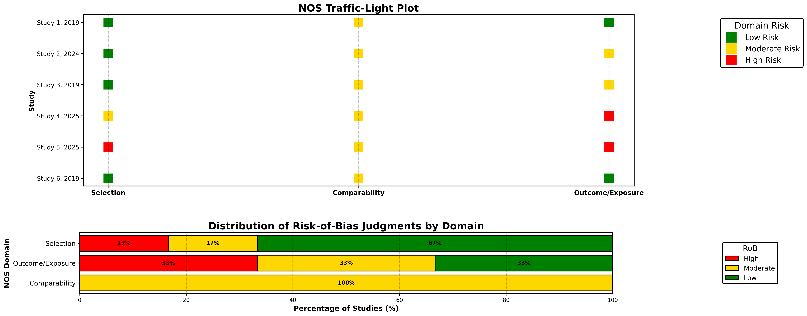

# NOS-TLPlot 

[](https://www.python.org/)
[](https://opensource.org/licenses/Apache-2.0)
[](https://nos-tlplot.streamlit.app)
[](https://doi.org/10.5281/zenodo.YOUR_DOI_HERE)


**NOS-TLPlot** is an open-source Python tool for **visualising Newcastle-Ottawa Scale (NOS) risk-of-bias assessments**.
It converts NOS star ratings into **publication-ready traffic-light plots**, allowing reviewers and readers to quickly interpret study-level risk-of-bias in systematic reviews and meta-analyses.

🔗 **Interactive web app:** [nos-tlplot.streamlit.app](https://nos-tlplot.fly.dev)
📂 **Code & archive (Zenodo DOI):** *(Insert DOI here)*

---

## ✨ Key Features

* Converts NOS star ratings into **traffic-light plots**.
* Generates **publication-quality figures** (`.png`) with stacked domain-level percentages.
* Open-source, fully reproducible, usable via **Python script** or **Streamlit app**.
* Adjustable figure size, line thickness, and legends.
* Scope limited to **NOS assessments of non-randomised studies**.

---

## 📥 Installation

```bash
git clone https://github.com/aurumz-rgb/NOS-TLPlot.git
cd NOS-TLPlot
pip install -r requirements.txt
```

> Tested with **Python 3.10+**, **Matplotlib**, **Seaborn**, and **Pandas**.

---

## ⚡ Usage

### 1️⃣ Python Script

```bash
python nos_tlplot.py input.csv output.png
```

* `input.csv` – CSV containing your NOS assessment data.
* `output.png` – File path to save the generated traffic-light figure.

**CSV column requirements:**

| Column Name                | Description           |
| -------------------------- | --------------------- |
| Author, Year               | Study author and year |
| Representativeness         | NOS stars (0–1)       |
| Non-exposed Selection      | NOS stars (0–1)       |
| Exposure Ascertainment     | NOS stars (0–1)       |
| Outcome Absent at Start    | NOS stars (0–1)       |
| Comparability (Age/Gender) | NOS stars (0–2)       |
| Comparability (Other)      | NOS stars (0–2)       |
| Outcome Assessment         | NOS stars (0–1)       |
| Follow-up Length           | NOS stars (0–1)       |
| Follow-up Adequacy         | NOS stars (0–1)       |
| Total Score                | Computed total stars  |
| Overall RoB                | Low / Moderate / High |

> **Tip for reviewers:** Include the raw NOS scoring table in supplementary material for full reproducibility.

---

### 2️⃣ Streamlit Web App

```bash
streamlit run app.py
```

* Upload your CSV to instantly visualize **traffic-light plots**.
* Adjust figure parameters for **publication-ready output**.

---

## 📖 Methods Notes (for SRMA)

* **Risk-of-bias assessment:** Conducted using the **Newcastle-Ottawa Scale (NOS)**.
* **Visualisation:** Generated using **NOS-TLPlot**, an open-source plotting tool.
* **Transparency:** Raw NOS scores are provided in **Supplementary Table Sx**.
* **Reproducibility:** Code and example CSV archived at **Zenodo DOI**, ensuring figures can be reproduced exactly.
* **Scope:** NOS-TLPlot is a **visualisation tool only**; it does **not modify NOS scoring**.

> This ensures reviewers can independently verify the **methods, data, and output** of the traffic-light plots.

---

## 📄 License

Apache 2.0 © 2025 Vihaan Sahu

---

## ✅ Reviewer-Friendly Notes

* Clearly states that NOS-TLPlot is **visualisation-only**, not a bias assessment tool.
* Emphasises **reproducibility** with example CSV + archived code (Zenodo DOI).
* Raw NOS scores are referenced for **supplementary materials**.
* Limited to NOS, avoiding general applicability confusion.
* Minimal, copy-paste ready installation and usage instructions.

---

I have also **draft the supplementary table + methods snippet** exactly as **BMJ or Cochrane reviewers expect**, including a dummy CSV (`sample.csv` / `sample.xlsx`) ready to drop into your SRMA for reproducibility.
Use the `sample_data` folder.

---

## 📸 Example / Result




Here’s an example traffic-light plot generated using NOS-TLPlot.

---

## 🖼 Preview of NOS-TLPlot


Screenshot of the interactive app.


---

## 🔹 How NOS Scores Are Converted to Risk-of-Bias (RoB)

NOS-TLPlot converts domain-specific NOS star ratings into **Low, Moderate, or High risk-of-bias** using the following rules:

* **Selection domain (max 4 stars)**  
  * 3–4 stars → Low RoB  
  * 2 stars → Moderate RoB  
  * 0–1 stars → High RoB  

* **Comparability domain (max 2 stars)**  
  * 2 stars → Low RoB  
  * 1 star → Moderate RoB  
  * 0 stars → High RoB  

* **Outcome/Exposure domain (max 3 stars)**  
  * 3 stars → Low RoB  
  * 2 stars → Moderate RoB  
  * 0–1 stars → High RoB  

This ensures consistent domain-level judgements across all studies, which are then visualized in the traffic-light plots.
